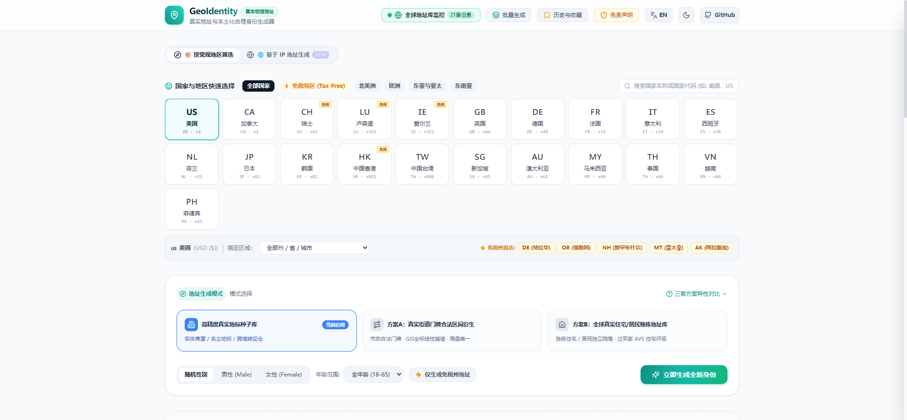
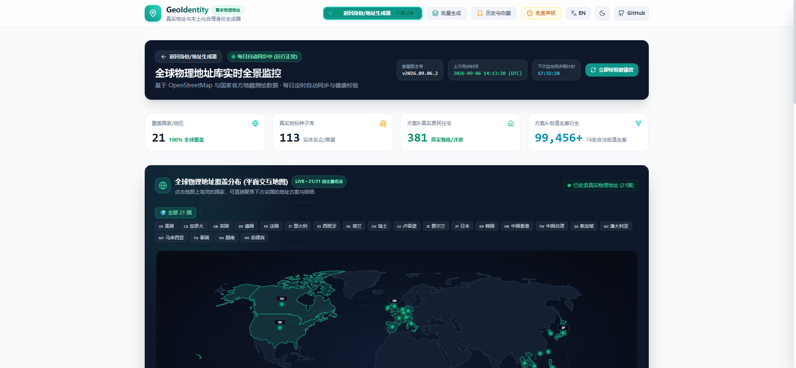
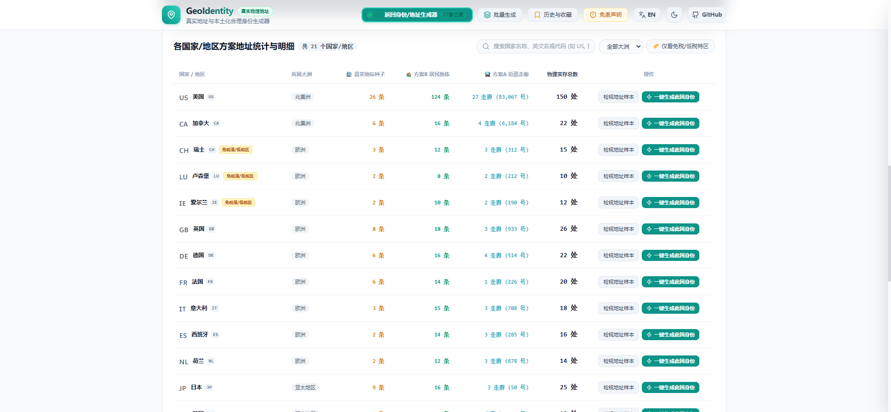

# GeoIdentity - OSM 建筑门牌与合成测试身份

<p align="center">
  
</p>

<p align="center">
  <strong>仅从可回溯 OpenStreetMap 对象的公寓建筑门牌生成地址</strong><br>
  个人资料为合成测试数据；建筑门牌不代表住户、房号、可投递地址或 AVS 认证
</p>

<p align="center">
  <a href="https://github.com/AiLi1337/GeoIdentity/blob/main/LICENSE"></a>
  <a href="https://vuejs.org/"></a>
  <a href="https://www.typescriptlang.org/"></a>
  <a href="https://tailwindcss.com/"></a>
  <a href="https://pages.cloudflare.com/"></a>
</p>

---

🌐 **线上演示与正式访问**：[https://vllme.com/](https://vllme.com/) （备用镜像：[https://address.vllme.com/](https://address.vllme.com/)）

---

## 📸 项目界面预览 (Screenshots)

### 1. 身份与地址生成主控制台（历史截图；现已采用来源严格模式）


### 2. 建筑地址来源与合成身份测试卡片（历史截图）


### 3. 历史全球覆盖视图（已由 OSM 来源清单替代）


### 4. 历史地址样本统计（旧模式不再作为来源地址生成）


---

## 🌟 核心特性

- **可核对地址来源**：目前收录美国 Wilmington（DE）和 Portland（OR）的 51 条 OSM 公寓建筑门牌，每条可打开原始 OSM 对象。其他国家/州没有可核对数据时明确提示，不跨地区兜底。
- **边界**：OSM 是众包数据。建筑门牌及坐标有来源链接，但没有独立的邮政投递、住户、房号、产权或 AVS 认证；本站不承诺“绝对真实”到上述层级。
- **旧数据**：内置 21 国住宅样本和街道插值规则仍在源码中供历史/测试兼容，但网页标准、批量和 IP 生成不再使用它们当作可核对地址。
- 🗺️ **三地图引擎与防“IP 送中”安全沙箱**：
  - 默认首选 **OpenStreetMap (OSM)**：国内 100% 免翻直连秒开，真实建筑门牌无偏移，零送中风险；
  - 备选 **Bing Maps (必应地图)**：微软官方全球道路图与高分辨率卫星图；
  - **Google Maps 隔离门禁**：默认绝不发起静默请求，支持点击确认加载；生成新身份自动重新上锁 (Auto-Relock)；物理拦截浏览器 HTML5 定位回传，保护海外 VPS 原生 IP。
- 📦 **电商与转运仓合规双行地址生成**：
  - **Address Line 1**：真实实体街道与门牌。
  - **Address Line 2**：保持空白，不虚构房号。
  - **多行格式复制**：仅用于合规开发测试，不用于真实收件或付款验证。
- 🛠️ **全套生产力工具**：
  - 单字段一键复制（带打勾动画与 Toast 反馈）。
  - 一键复制完整结构化测试档案。
  - 批量生成（5/10/20/50 条）与 **CSV / JSON 导出**（含 Address Mode 与 AVS Tier）。
  - 本地 LocalStorage 历史记录抽屉与星标收藏夹。
  - 深色 / 浅色模式自适应，中英双语国际化无缝切换。

---

## ⚡ 使用 Cloudflare 部署教程

本项目为纯静态 SPA（单页面应用），天生完美契合 **Cloudflare Pages** 全球边缘分发网络，具备全球极速访问、自动 HTTPS 证书、DDoS 防护和 100% 免费额度。

### 方式一：连接 GitHub 仓库自动持续部署 (推荐，零运维)

这是最推荐的部署方式。绑定后，每次你向 GitHub 仓库 `push` 代码，Cloudflare Pages 会自动拉取、构建并分发到全球 300+ 数据中心。

1. 登录 [Cloudflare 控制台](https://dash.cloudflare.com/)；
2. 在左侧导航栏点击 **Workers 和 Pages (Workers & Pages)** ➔ **创建应用程序 (Create application)**；
3. 选择 **Pages** 选项卡 ➔ 点击 **连接到 Git (Connect to Git)**；
4. 授权并选择你的本开源仓库（例如 `AiLi1337/GeoIdentity`）；
5. 配置构建预设与命令：
   - **项目名称 (Project name)**：`geo-identity`（或自定义名称）
   - **生产分支 (Production branch)**：`main`
   - **框架预设 (Framework preset)**：`Vite`
   - **构建命令 (Build command)**：`npm run build`
   - **构建输出目录 (Build output directory)**：`dist`
   - **环境变量 (Environment variables)** *(可选，建议配置)*：
     - 添加变量：`NODE_VERSION` = `20` 或 `22`
6. 点击 **保存并部署 (Save and Deploy)**；
7. 等待约 1 分钟，Cloudflare 即构建完成并提供一个类似 `https://geo-identity.pages.dev` 的全球访问网址。

---

### 方式二：使用 Cloudflare Wrangler CLI 命令行一键部署

如果你习惯在本地终端直接构建并发布，可以通过官方 CLI 工具 `wrangler`：

```bash
# 1. 在本地克隆并进入项目目录
git clone https://github.com/AiLi1337/GeoIdentity.git
cd GeoIdentity

# 2. 安装项目依赖
npm install

# 3. 本地打包构建生成 dist 产物
npm run build

# 4. 首次使用请登录 Cloudflare 账户 (会弹出浏览器授权)
npx wrangler login

# 5. 一键发布构建产物到 Cloudflare Pages
npx wrangler pages deploy dist --project-name geo-identity --branch main
```

部署完成后，终端会立即输出本次部署的生产预览链接。

---

### 绑定自定义域名 (Custom Domains)

想要使用自己的域名（如 `vllme.com` 或 `address.yourdomain.com`）：

1. 进入 Cloudflare Dashboard ➔ **Workers & Pages** ➔ 点击你的 Pages 项目；
2. 切换到 **自定义域 (Custom domains)** 选项卡；
3. 点击 **设置自定义域 (Set up a custom domain)**，输入你的域名并按提示一键完成 DNS 解析绑定；
4. Cloudflare 会在数分钟内自动完成全球 CDN 广播并签发免费的 SSL/TLS 证书。

---

### 开启每日地址库自动健康同步 (GitHub Actions)

项目仓库内已内置每日自动化调度工作流 [`.github/workflows/daily-address-sync.yml`](.github/workflows/daily-address-sync.yml)：
* **定时运行**：计划每天 UTC 00:00（北京时间 08:00）运行；GitHub 的定时任务可能延迟。
* **公开数据采样**：从 [OpenStreetMap contributors](https://www.openstreetmap.org/copyright) (ODbL) 获取特拉华州 Wilmington 与俄勒冈州 Portland 的公开公寓建筑门牌、邮编、城市和坐标，过滤无效或重复记录，写入 `osmApartments.json`，并加入方案 C。只代表 OSM 有建筑门牌，**不保证可投递或通过 AVS**，不关联住户。
* **失败处理**：上游查询失败时任务失败，保留仓库已有数据和上次成功时间。页面显示的是已部署包的数据快照，并非实时查询；页面按钮只校验本地字段和数量。
* **部署设置**：在 GitHub 仓库 Secrets 设置 `CLOUDFLARE_API_TOKEN`（对目标 Pages 项目有部署权限）、`CLOUDFLARE_ACCOUNT_ID` 与 `VITE_ADSENSE_ID`，在 Variables 设置 `CF_PAGES_PROJECT`（Pages 项目名，例如 `geo-identity`）。任务先做无广告构建并仅提交地址数据，再用 Secret 构建带广告的 `dist` 上传 Cloudflare；`dist`、`ads.txt` 和广告脚本不会推送到 Git。请确认 `address.vllme.com` 绑定在同一个项目；缺少部署配置时任务会失败，而不会假报部署成功。
* **许可**：新增 OSM 数据受 [Open Database License](https://opendatacommons.org/licenses/odbl/) 约束，使用或再分发时保留归属与许可要求。原有静态地址库不由 OSM 同步验证。

---

## 🚀 本地开发与测试

确保本地已安装 [Node.js](https://nodejs.org/) (推荐 v18+ 或 v20+)。

```bash
# 1. 安装依赖
npm install

# 2. 运行自动化测试套件 (包含 2,462 项端到端规则与隔离断言)
npm test

# 3. 运行地址库同步与元数据校验
npm run sync:addresses

# 4. 启动本地开发服务器 (支持 Vite HMR 热更新)
npm run dev

# 5. 构建生产代码
npm run build

# 6. 本地预览生产构建产物
npm run preview
```

---

## 📄 开源协议 (License)

本项目基于 [MIT License](LICENSE) 协议完全开源。欢迎 Star ⭐、Fork 与提交 Pull Request！

---

## ⚖️ 法律合规免责声明 (Disclaimer)

1. 本项目所生成的个人姓名、证件号码、虚拟银行卡号及联系电话等均为前端算法伪随机生成的**虚拟合成测试数据 (Synthetic Data)**，仅供合规软件开发、UI排版与表单校验测试使用。
2. 实体街道与建筑地址源自公开地理测绘与地籍信息，真实存在但与算法生成的虚构人名没有任何从属、产权或居住关联。
3. 严禁将本项目用于任何金融欺诈、电信网络诈骗、冒用他人身份等违法犯罪行为。
